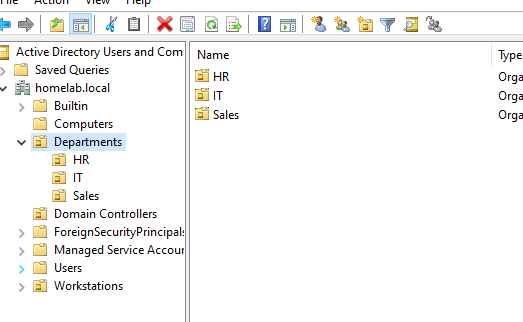
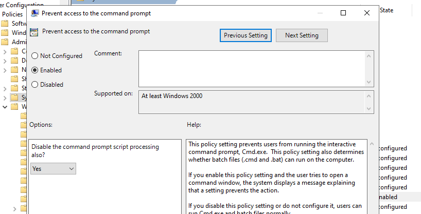
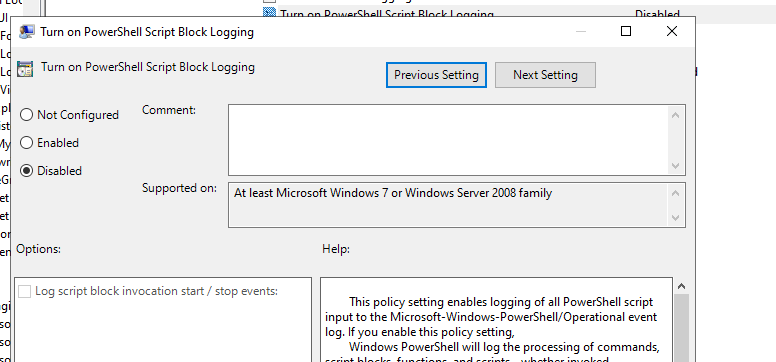
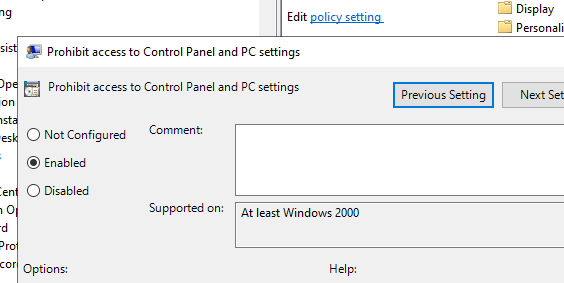
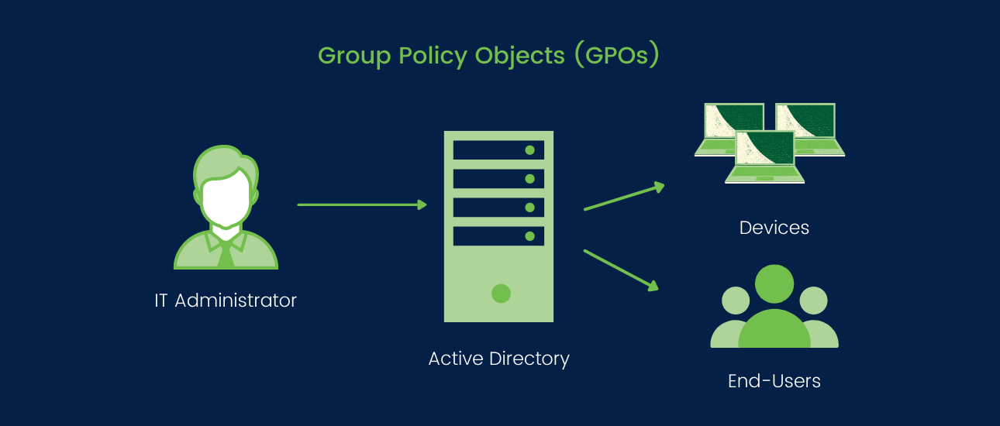

<h1 align="center">🏢 Active Directory Enterprise Homelab</h1>

<b>🔑 Project Overview</b> 
This project recreates a complete enterprise‑style Active Directory environment inside a homelab, including OU design, GPO separation, workstation policies, and security hardening aligned with real corporate practices.

<b>📁 Active Directory Structure</b>
<pre>
homelab.local
 ├── Departments
 │    ├── HR
 │    ├── IT
 │    └── Sales
 ├── Workstations
 └── Domain Controllers
</pre>

<b>👥 Department Policies</b>

<b>HR‑Restrictions (User GPO)</b>
<ul>
    <li>CMD disabled</li>
    <li>PowerShell disabled</li>
    <li>Control Panel & Settings blocked</li>
    <li>Settings app hidden</li>
    <li>Department wallpaper applied</li>
    <li>Fully restricted environment for non‑technical staff</li>
</ul>

		
		
		
		

<b>IT‑Workstation‑Policy (Computer GPO)</b>
<ul>
    <li>PowerShell enabled (Allow all scripts)</li>
    <li>Script Block Logging enabled</li>
    <li>Module Logging enabled</li>
    <li>Remote Desktop enabled</li>
    <li>CMD allowed</li>
    <li>IT‑Helpdesk added to Local Administrators</li>
    <li>RSAT visibility enabled</li>
</ul>

		

<b>Sales‑Restrictions (User GPO)</b>
<ul>
    <li>CMD disabled</li>
    <li>PowerShell disabled</li>
    <li>Control Panel blocked</li>
    <li>Wallpaper applied</li>
    <li>Drive mapping via GPP: S: → \\dc01\shares\sales</li>
</ul>

		
		
		
		

<b>🧩 Key Features Implemented</b>
<ul>
    <li>Role‑based access control via IT‑Helpdesk</li>
    <li>Advanced PowerShell auditing</li>
    <li>Drive Maps using Group Policy Preferences</li>
    <li>Department‑specific security baselines</li>
    <li>Clean, scalable OU structure</li>
    <li>Centralized ADMX management</li>
</ul>

<b>🛠️ Tech Stack</b>
<table>
	<tr>
		<th><b>Category</b></th>
		<th><b>Technologies</b></th>
	</tr>
	<tr>
		<td><b>Server OS</b></td>
		<td>Windows Server 2022</td>
	</tr>
	<tr>
		<td><b>Directory Services</b></td>
		<td>Active Directory Domain Services</td>
	</tr>
	<tr>
		<td><b>Policy Management</b></td>
		<td>Group Policy Management, Centralized ADMX</td>
	</tr>
	<tr>
		<td><b>Workstations</b></td>
		<td>Windows 10 Enterprise</td>
	</tr>
	<tr>
		<td><b>Scripting</b></td>
		<td>PowerShell</td>
	</tr>
</table>

<b>📁 Project Structure</b>
<pre>
Code
homelab.local/
 ├── Departments/
 │    ├── HR/
 │    ├── IT/
 │    └── Sales/
 ├── Workstations/
 ├── Domain Controllers/
 ├── Group Policy Objects/
 └── Security Baselines/
</pre>

<b>🚧 Next Steps (Planned Updates)</b>
<ul>
		<li>🔐 Workstation Hardening: AppLocker, USB restrictions, Task Manager/Run dialog lockdown, Windows Firewall rules</li>
		<li>🧩 Group Policy Expansion: Sales workstation policy, login banners, advanced audit policies</li>
		<li>🛡️ Security & Monitoring: Wazuh agents, SIEM log forwarding, alerting for PowerShell/RDP/auth anomalies</li>
		<li>🌐 Network Segmentation: VLANs, DHCP scopes, DNS scavenging/forwarding</li>
		<li>🗂️ Infrastructure Enhancements: Second DC, DFS-R, file server with NTFS permissions</li>
		<li>🧪 Automation & Scripting: PowerShell user/OU/GPO automation, workstation onboarding</li>
		<li>📊 Documentation & Visualization: Architecture diagram, GPO screenshots, PDF portfolio</li>
</ul>