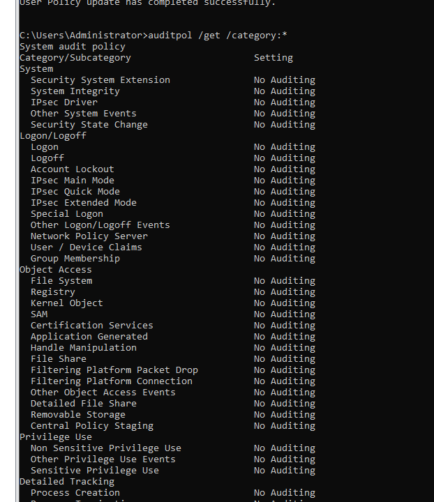
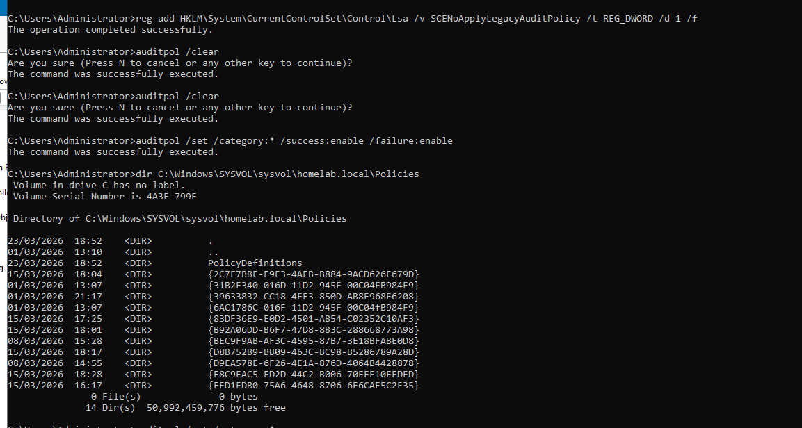
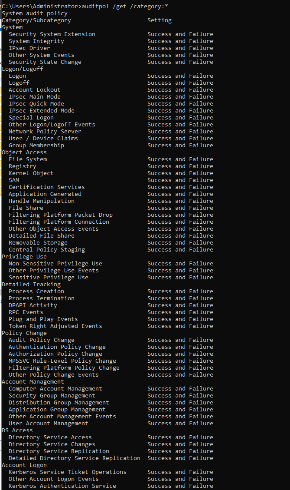
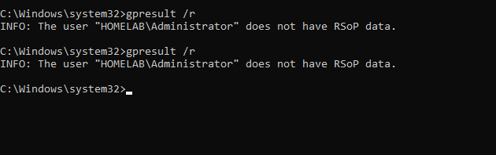

<h1>🛠️ Domain Controller Troubleshooting Log (Advanced Audit Policy Fix)</h1>

During the build‑out of the enterprise homelab, DC01 encountered a real‑world issue where Advanced Audit Policy refused to apply, even though all GPOs appeared correct. This section documents the investigation, root cause, and final remediation — exactly the kind of scenario that happens in production AD environments.

<b>🔍 What I Found</b>
<ul>
    <li><code>auditpol /get /category:*</code> returned <code>No Auditing</code> across all categories</li>
    <li><code>auditpol /get /option</code> failed with <code>0x00000057</code> – The parameter is incorrect</li>
    <li>GPMC was missing modern audit settings (e.g., <i>Force audit policy subcategory settings…</i>)</li>
    <li>SYSVOL looked healthy, but no <code>Audit.csv</code> was being applied</li>
    <li>GPOs appeared to apply, but the audit engine was stuck in legacy mode</li>
</ul>

    

<b>🧪 What I Did</b>
<ul>
    <li>Verified SYSVOL structure and GPO GUID folders</li>
    <li>Checked for missing or corrupted <code>Audit.csv</code> files</li>
    <li>Forced Advanced Audit mode via registry (<code>SCENoApplyLegacyAuditPolicy = 1</code>)</li>
    <li>Reset the audit engine (<code>auditpol /clear</code>)</li>
    <li>Reapplied full audit subcategory configuration</li>
    <li>Collected diagnostics: <code>gpresult</code>, <code>scesrv.log</code>, <code>auditpol</code> outputs</li>
    <li>Performed manual subcategory tests to isolate the failure</li>
</ul>

    

<b>🧩 Root Cause</b>

The Domain Controller was missing a Central Store (<code>PolicyDefinitions</code>) inside SYSVOL:

<pre>
\\homelab.local\SYSVOL\homelab.local\Policies\PolicyDefinitions
</pre>

Because the Central Store did not exist:
<ul>
    <li>GPMC loaded incomplete/legacy ADMX templates</li>
    <li>Advanced Audit Policy settings were not visible</li>
    <li>No <code>Audit.csv</code> was being applied from any GPO</li>
    <li>The audit engine could not initialize properly</li>
</ul>

<b>🛠️ Final Fix</b>
<ul>
    <li>Created the missing <code>PolicyDefinitions</code> folder in SYSVOL</li>
    <li>Populated it with a complete Windows 10/11 ADMX/ADML set</li>
    <li>Forced Windows to ignore legacy audit mode</li>
    <li>Reset and reinitialized the audit engine</li>
    <li>Reapplied all audit subcategories</li>
    <li>Verified the final state with <code>auditpol</code></li>
</ul>

<b>✅ Current Status</b>

The audit engine is now fully operational:

    

All categories now show:
<pre>
Success and Failure
</pre>

The domain is now ready for:
<ul>
    <li>SIEM ingestion</li>
    <li>PowerShell logging</li>
    <li>Sysmon deployment</li>
    <li>Forensic readiness</li>
</ul>

<b>🚧 Troubleshooting Barriers & Lessons Learned</b>

<b>🔒 Barriers Encountered</b>
<ul>
    <li>Missing Central Store prevented GPMC from exposing modern audit settings</li>
    <li>Legacy audit mode silently blocked Advanced Audit Policy</li>
    <li><code>auditpol /get /option</code> errors masked the underlying issue</li>
    <li>SYSVOL looked healthy, making the root cause non‑obvious</li>
    <li>GPOs appeared to apply, but no <code>Audit.csv</code> existed to enforce them</li>
</ul>

    

<b>🧠 What This Reinforced</b>
<ul>
    <li>SYSVOL health ≠ GPO health</li>
    <li>ADMX completeness is critical for enterprise policy management</li>
    <li>Advanced Audit Policy requires explicit initialization</li>
    <li>Legacy audit mode can override everything unless disabled</li>
    <li>Troubleshooting AD requires checking registry, SYSVOL, GPO, and <code>auditpol</code> together</li>
</ul>

<b>🛠️ Tech Stack</b>
<table>
    <tr>
        <th><b>Category</b></th>
        <th><b>Technologies</b></th>
    </tr>
    <tr>
        <td><b>Server OS</b></td>
        <td>Windows Server 2022</td>
    </tr>
    <tr>
        <td><b>Directory Services</b></td>
        <td>Active Directory Domain Services</td>
    </tr>
    <tr>
        <td><b>Policy Engine</b></td>
        <td>Advanced Audit Policy, Group Policy, ADMX Central Store</td>
    </tr>
    <tr>
        <td><b>Diagnostics</b></td>
        <td>auditpol, gpresult, scesrv.log, RSoP</td>
    </tr>
    <tr>
        <td><b>Scripting</b></td>
        <td>PowerShell, Registry Editor</td>
    </tr>
</table>
